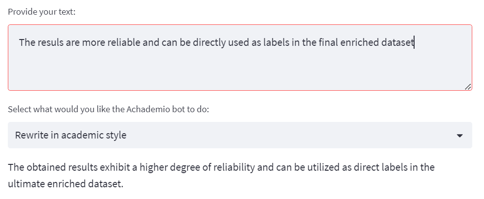

# Achademio - an AI-based assistant for improving your research papers

AI assistant, based on the GPT-3.5 model by OpenAI, is designed to enhance your proficiency in writing research papers. It allows you to adapt your content to academic standards, transform bullet points into eloquent text, or enhance the quality of your writing through error detection.

The web interface offers a range of functionalities, empowering you to accomplish the following:
- **Academic Style Rewriting**: you can conveniently invoke the assistant to improve the style of your text by rewriting it in an academic style. Simply execute the program by pressing CTRL+Enter.
- **Academic Paragraph Generation**: By selecting this option from the drop-down menu, you can effortlessly convert your bullet point lists into cohesive academic paragraphs. 
- **Proofreading**: By selecting this option from the drop-down menu, you invoke the AI assistant to identify and highlight potential errors, enabling you to rectify and refine their work.

The model has a limitation of how many words it can process at once. Therefore, it is advisable to input shorter text sequences at a time to optimize its performance.

This program requires an OpenAPI key and some basic programming skills (to install the Streamlit python library and execute the program through the command line.) More detailed instructions for setup and utilization are provided below.

Let me know via an Issue if you would like to have any other functionalities!

## Examples

**Academic Style Rewriting**

**Academic Paragraph Generation**

**Proofreading**

## Use

1. Clone this repository.
2. Install streamlit: `pip install streamlit install pip-run --user` and streamlit-chat: `pip install streamlit_chat`
3. Create an OpenAI account to get a API key (see https://elephas.app/blog/how-to-create-openai-api-keys-cl5c4f21d281431po7k8fgyol0). Save the API key in line 5 of `achademio.py` or in a separate file, named `API_key` (make sure that you do not share it with anyone).
4. Run the streamlit python script in the command line with the following command: `python -m streamlit run achademio.py`
5. A website will open in your browser where you can use the Achademio bot to improve your academic texts.

## Costs

New users of the OpenAPI key are granted a complimentary $18 credit, so the initial utilization of the model comes at no expense to you. After this amount is spent, the usage of the program is based on the cost of GPT-3.5 model, which is $0.0015/1K tokens for input and $0.002/1K tokens for model's output. You can track your expenses in the `Manage account` menu item under `Personal` at https://platform.openai.com/. The costs are very affordable: if you would input to the AI assistant 1,000 words (approximately 2 pages), the total expense would amount to less than $5.