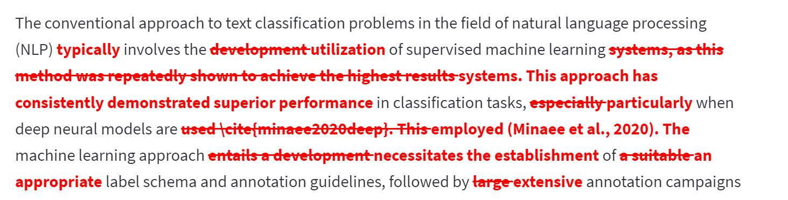
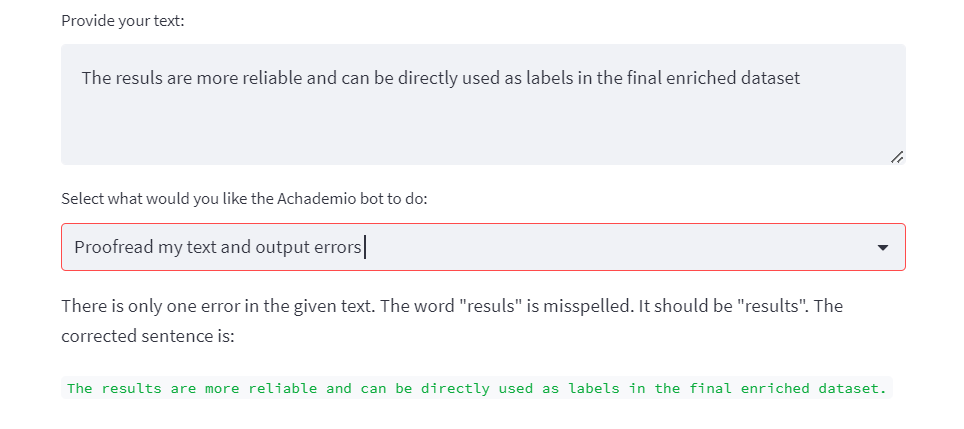

# Achademio - an AI-based assistant for improving your research papers

AI assistant, based on the GPT-3.5 model by OpenAI, is designed to enhance your proficiency in writing research papers. It allows you to adapt your content to academic standards, transform bullet points into eloquent text, or enhance the quality of your writing through error detection.

Clone the repository and run it with python and streamlit module, or deploy it for your personal use to [Streamlit Community Cloud](https://streamlit.io/cloud). 

The web interface offers a range of functionalities, empowering you to accomplish the following:
- **Academic Style Rewriting**: you can conveniently invoke the assistant to improve the style of your text by rewriting it in an academic style. Simply execute the program by pressing CTRL+Enter.
- **Academic Paragraph Generation**: By selecting this option from the drop-down menu, you can effortlessly convert your bullet point lists into cohesive academic paragraphs. 
- **Proofreading**: By selecting this option from the drop-down menu, you invoke the AI assistant to identify and highlight potential errors, enabling you to rectify and refine their work.

The model has a limitation of how many words it can process at once. Therefore, it is advisable to input shorter text sequences at a time to optimize its performance.

This program requires an OpenAPI key and some basic programming skills (to install the Streamlit python library and execute the program through the command line.) More detailed instructions for setup and utilization are provided below.

Let me know via an Issue if you would like to have any other functionalities!

## Update

The rewritten text now includes information on what has changed for easier implementation of changes:

## Examples

**Academic Style Rewriting**

**Academic Paragraph Generation**

**Proofreading**

## Use

1. Clone this repository.
2. Install streamlit: `pip install streamlit install pip-run --user`, and openai: `pip install openai`, and redlines `pip install redlines`
3. Create an OpenAI account to get a API key (see https://elephas.app/blog/how-to-create-openai-api-keys-cl5c4f21d281431po7k8fgyol0). Save the API key in line 5 of `achademio.py` or in a separate file *secrets.toml* in a *.streamlit* folder (path: \.streamlit\secrets.toml): `API_KEY = "[your-key]"` (make sure that you do not share it with anyone).
4. Run the streamlit python script in the command line with the following command: `python -m streamlit run achademio.py`. A website will open in your browser where you can use the Achademio bot to improve your academic texts.
5. Or deploy the streamlit app to Streamlit Cloud Community: follow the [instructions here](https://blog.streamlit.io/host-your-streamlit-app-for-free/#:~:text=Connect%20your%20account%20to%20GitHub,-There%20are%20two&text=On%20the%20authorization%20page%2C%20click%20on%20%E2%80%9CAuthorize%20streamlit.%22&text=This%20will%20let%20Community%20Cloud,%2C%20click%20%E2%80%9CAuthorize%20streamlit.%22&text=Now%20you're%20ready%20to%20deploy%20Streamlit%20apps!).

## Costs

New users of the OpenAPI key are granted a complimentary $18 credit, so the initial utilization of the model comes at no expense to you. After this amount is spent, the usage of the program is based on the cost of GPT-3.5 model, which is $0.0015/1K tokens for input and $0.002/1K tokens for model's output. You can track your expenses in the `Manage account` menu item under `Personal` at https://platform.openai.com/. The costs are very affordable: if you would input to the AI assistant 1,000 words (approximately 2 pages), the total expense would amount to less than $4.

## Please note

Please note that the results are based on a generative language model and require careful consideration before being used -- make sure to read all outputs carefully and use common sense when making use of them. If your initial text is hard to understand or contains many errors, the model might interpret the text incorrectly, so always check whether your statement still holds. It could also happen that the generated text would omit negation and by that change the meaning of the sentence, so make sure to check the output before using it.

The assistant should be used for improving the style of the text that you have written by yourself and verified facts based on trusted sources, and not for generating new statements (please consider that big blocks of generated text might come from a published work and using them without citing the work would be plagiarism).

## License

MIT License

Copyright (c) 2023 Taja Kuzman

Permission is hereby granted, free of charge, to any person obtaining a copy
of this software and associated documentation files (the "Software"), to deal
in the Software without restriction, including without limitation the rights
to use, copy, modify, merge, publish, distribute, sublicense, and/or sell
copies of the Software, and to permit persons to whom the Software is
furnished to do so, subject to the following conditions:

The above copyright notice and this permission notice shall be included in all
copies or substantial portions of the Software.

THE SOFTWARE IS PROVIDED "AS IS", WITHOUT WARRANTY OF ANY KIND, EXPRESS OR
IMPLIED, INCLUDING BUT NOT LIMITED TO THE WARRANTIES OF MERCHANTABILITY,
FITNESS FOR A PARTICULAR PURPOSE AND NONINFRINGEMENT. IN NO EVENT SHALL THE
AUTHORS OR COPYRIGHT HOLDERS BE LIABLE FOR ANY CLAIM, DAMAGES OR OTHER
LIABILITY, WHETHER IN AN ACTION OF CONTRACT, TORT OR OTHERWISE, ARISING FROM,
OUT OF OR IN CONNECTION WITH THE SOFTWARE OR THE USE OR OTHER DEALINGS IN THE
SOFTWARE.
